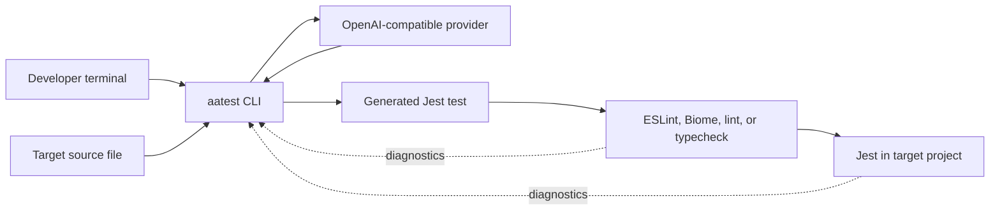
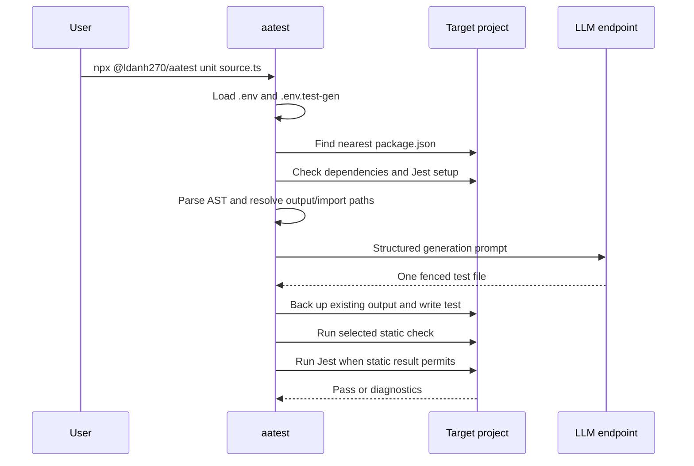
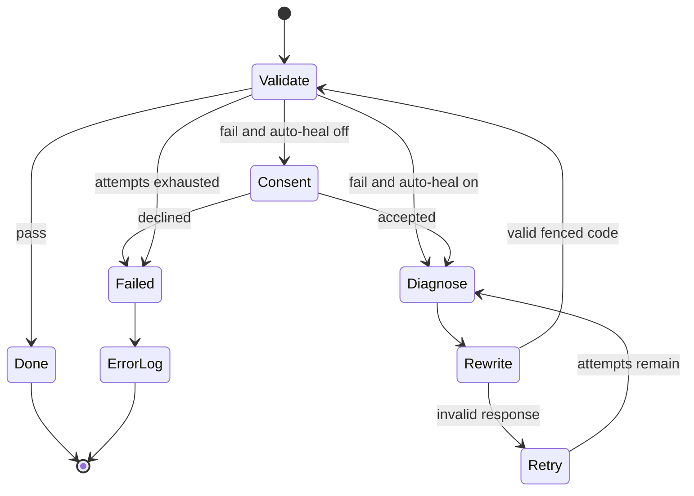

# System architecture

## Context

`aatest` is a local CLI. It reads one target source file, calls an external or
local OpenAI-compatible provider, writes one generated test, and executes target
project validation tools.



## Generation sequence



## Project-root model

Two directories matter:

- **Invocation directory:** where the process starts; owns `.env` and
  `.env.test-gen` loading.
- **Target project root:** nearest `package.json` above the source file; owns
  dependencies, relative output resolution, lint scripts, Jest configuration,
  and process execution.

They are often the same but need not be. This distinction enables direct use of
a locally built CLI against another codebase while keeping project behavior
anchored to the target package.

## AST analysis

The Babel parser reads the complete source and extracts:

- Language from extension
- ESM or CommonJS import style
- Imports/requires and heuristic dependency categories
- Named/default exported functions and variables
- Exported classes and public instance methods
- Common Express route registrations

The prompt includes exact source content up to its size threshold, extracted
dependencies, testable exports, routes, and the calculated import path.

This is intentionally heuristic. It is not a full TypeScript type checker or
framework dependency graph.

## Provider boundary

The provider client sends `model` and `messages` through OpenAI Chat
Completions. The base URL, key, and model are runtime configuration. 9Router,
OpenRouter, Groq, Ollama, and LM Studio are integrations by compatibility, not
hard-coded adapters.

Provider calls occur for:

1. Initial generation
2. Root-cause analysis for each failed repair attempt
3. Full-file rewrite for each failed repair attempt

The provider boundary never receives arbitrary custom headers or templates in
the current product.

## Output model

The output path mirrors source segments below `src` under `sourceDir` and adds
`.spec` before the original extension. Existing output is copied to a timestamped
`.bak` before initial replacement.

The LLM response parser accepts JavaScript, TypeScript, or bare fenced code. A
TypeScript test is normalized to begin with a Jest type reference.

## Validation architecture

Static-check selection favors file-scoped local tools:

```text
local ESLint
  -> local Biome
  -> package lint script
  -> package typecheck script
  -> skip with warning
```

Relevant static failures block Jest so the repair prompt receives the most
immediate signal. Unrelated project-wide failures are reported but do not prevent
generated-file Jest execution.

Jest runs only the generated file, in-band, without coverage or colors, with
force-exit behavior and a 60-second process timeout.

## Healing state machine



The validation result is the state passed into the next diagnosis. Success is a
terminal condition regardless of the configured maximum.

## Security boundaries

- Source and diagnostics leave the process for the configured provider.
- Model output becomes executable test code.
- Dependency setup and project scripts can mutate or execute target code.
- Process timeouts reduce hangs but are not an OS sandbox.
- Backups and Git reduce overwrite risk but do not validate model intent.

See [Security policy](../SECURITY.md) for operational controls.
